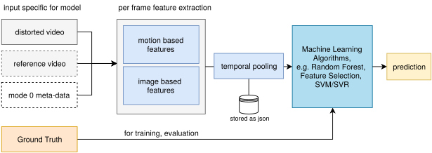

# Pixel based Video Quality Models for 4K

The following repository consists of in total four pixel based video quality prediction models, including no-reference, full-reference and for each baseline type a hybrid mode 0 based version.

All models are able to be used for video quality prediction of short video sequences (up to 10 seconds) in case of UHD-1/4K resolution with 60fps.

This repository also ships pre-trained models (see `pixelmodels/models`) that are trained on dedicated performed subjective video quality tests.
Moreover, all tools required to build new models are included in this repository, thus beside each models prediction code, e.g. `nofu`, also a `train_{modelname}` script is provided.


## Requirements
The models and software is only tested on linux systems (e.g. Ubuntu 19.04, 20.04)

The following software is required:

* python3, python3-pip, python3-venv
* poetry >= 1.0.3 (e.g. pip3 install poetry==1.0.3)
* ffmpeg
* git

To install all python3 dependencies, run the following command in the folder of this repository:

```bash
poetry install
```
(if you have problems with pip, run `pip3 install --user -U pip`)

poetry will manage a local virtual environment with suitable versions of all dependencies of the models.

## Included video quality models
In total in this repository four video quality models are included:

* `nofu`: no-reference pixel based model
* `hyfu`: hybrid no-reference pixel based model
* `fume`: full-reference pixel based model
* `hyfr`: hybrid full-reference model

Both hybrid models require access to bitrate, resolution, codec and framerate.
This meta-data will be automatically extracted from the given video files.
A full description of the models is presented in the mentioned paper `goering2020pixel`, see [Acknowledgments](#acknowledgments).

### Usage nofu

To use the provided tool, e.g. run
```bash
poetry run nofu predict test_videos/test_video_h264.mkv
```

### Retraining the models

To retrain the models it is required to have CSV files according to the used format of [AVT-VQDB-UHD-1](https://github.com/Telecommunication-Telemedia-Assessment/AVT-VQDB-UHD-1)

To enable the rating distribution training additional data is required, this is not official part of the AVT-VQDB-UHD-1 dataset, in case you need it contact the authors of this database.

For each model a `train_{modelname}` tool is provided that can be started, e.g. for nofu with the following command line:
```bash
poetry run train_nofu data/4k_databases_full/test_1/per_user.csv
```

Important for training all features stored in the feature directory will be used, this ensures that multiple databases can be used for an incremental and overall training.

## General Architecture


The general architecture of all models consists of performing a center cropping (default value is a 360p center crop) on the re-scaled videos (e.g. reference and distorted videos are unified to have the same resolutions/framerate/pixel format).
Afterwards for each video (e.g. only the distorted or distorted and reference) features for each frame and motion related features are estimated, here depending on the model the number of features varies.
After the feature extraction is performed, all extracted values for a given input video are temporally pooled to remove time dependencies.
The pooled feature values are later feed into a machine learning pipeline, that is random forest based.

All developed models can be used to predict:

* mos as classification
* mos as regression
* rating distribution as multi instance regression

For more details about the features and pipeline, checkout the paper `goering2020pixel`.

## Acknowledgments

If you use this software in your research, please include a link to the repository and reference the following paper.

```
@inproceedings{goering2020pixel,
  title={Modular Framework and Instances of Pixel-based Video Quality Models for UHD-1/4K},
  author={Steve G{\"{o}}ring and Rakesh Rao Ramachandra Rao and Bernhard Feiten and Alexander Raake},
  year={2020},
  organization={IEEE Access},
}
```

## License
GNU General Public License v3. See [LICENSE.md](./LICENSE.md) file in this repository.